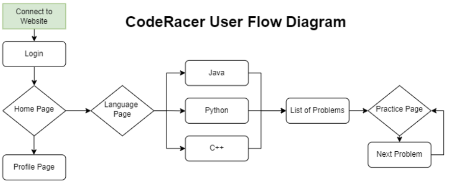

The webapp first gets the code stored on mongoDB using flask and creates a bunch of files that are stored on certain urls extended from the "base" url of the webapp. Then the React frontend fetches the code from these urls and displays them to the user. The user can then interact with the frontend and it will respond by giving the user details on their typing progress like time and speed. 

Though this feature is not yet implemented, the frontend should also be able to take code from the user and send to the flask backend to store. Then this code can then be used as a test later for the user to type on.

