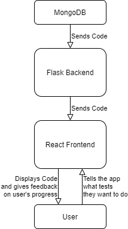
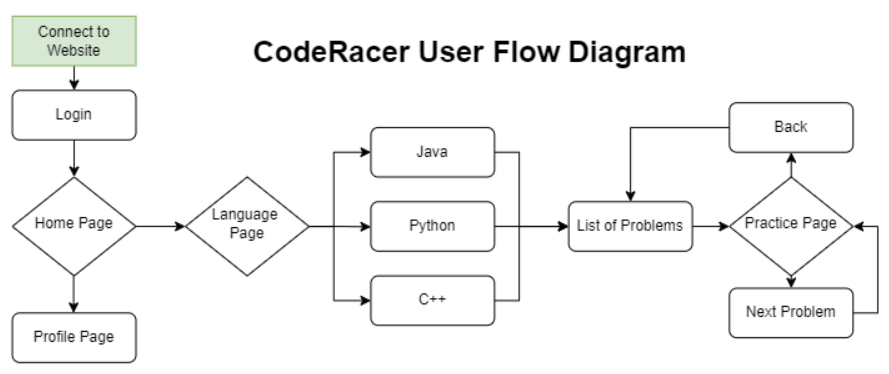

# Opening Overview
The webapp first gets the code stored on mongoDB using flask and creates a bunch of files that are stored on certain urls extended from the "base" url of the webapp. Then the React frontend fetches the code from these urls and displays them to the user. The user can then interact with the frontend and it will respond by giving the user details on their typing progress like time and speed. 

# More Detailed SW Architecture Design

Though this feature is not yet implemented, the frontend should also be able to take code from the user and send to the flask backend to store. Then this code can then be used as a test later for the user to type on. 

# Design Process Documentation Section
the React frontend fetches the code from these urls and displays them to the user. The user can then interact with the frontend and it will respond by giving the user details on their typing progress like time and speed. This was discussed in **RETRO 1**. Take code from the user and send to the flask backend to store. Then this code can then be used as a test later for the user to type on. This was discussed in **RETRO 2**.We made design choices to the profile page to save information of each use and this is something we will adress in **RETRO 3**.

Above is the user flow diagram. Once a user connects to the website, they must first login - this will bring them to the home page. From there, they can view their profile or begin practicing. To practice, they nagivate to the language page to select which language they wish to practice. Once this is specified, they can choose between a list of coding problems to practice. These coding problems have a difficulty, name, and skill in which they train (i.e. array). After finishing a problem, they can continue practicing by pressing "next problem" or "back" to select a different problem. Of course, at any time the user can navigate back to the language or home page by using the navbar at the top. 
